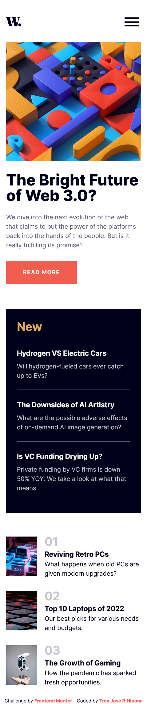
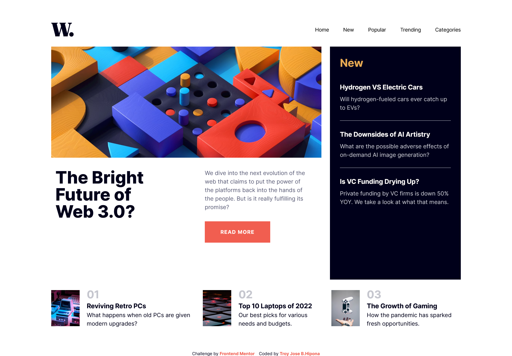

# Frontend Mentor - News homepage solution

This is a solution to the [News homepage challenge on Frontend Mentor](https://www.frontendmentor.io/challenges/news-homepage-H6SWTa1MFl). Frontend Mentor challenges help you improve your coding skills by building realistic projects.

## Table of contents

- [Overview](#overview)
  - [The challenge](#the-challenge)
  - [Screenshot](#screenshot)
  - [Links](#links)
  - [Built with](#built-with)
- [Author](#author)

## Overview
  This news homepage will be an excellent opportunity to practice your CSS Grid skills. There will be lots of tricky decisions to make and plenty of learning opportunities!

### The challenge

Users should be able to:

- View the optimal layout for the interface depending on their device's screen size
- See hover and focus states for all interactive elements on the page

### Screenshot

### Links

- Solution URL: [Github Repo](https://github.com/troyjosedev/news-homepage)
- Live Site URL: [Netlify Live Site](https://news-homepage-troy.netlify.app/)

### Built with

- Semantic HTML5 markup
- Tailwind
- Flexbox
- CSS Grid
- Mobile-first workflow
- [React](https://reactjs.org/) - JS library

## Author

- Github - [troyjosedev](https://github.com/)
- Frontend Mentor - [@troyjosedev](https://www.frontendmentor.io/profile/troyjosedev)
